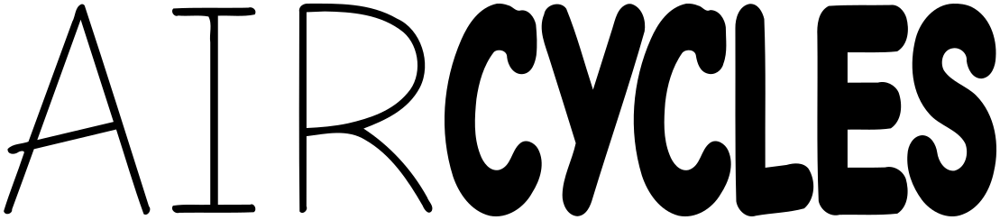
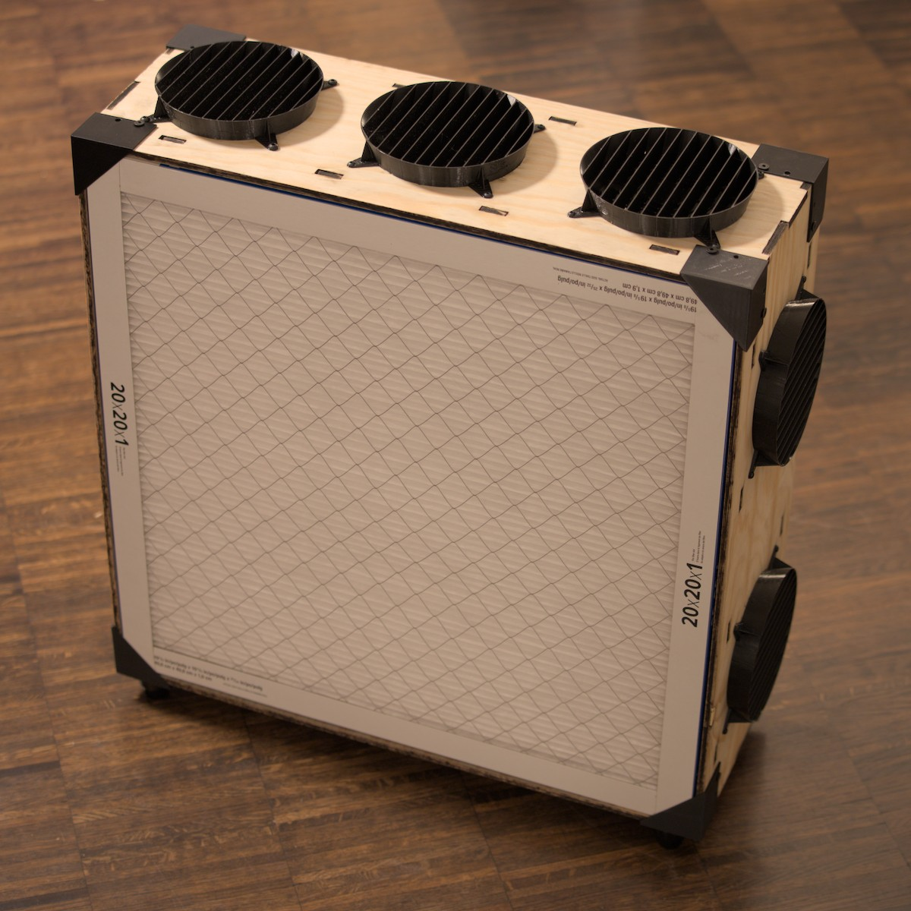

# Air Cycles

Air Cycles is our budget air purifier design for 39C3 (slogan "Power Cycles").

It is a [Corsi-Rosenthal box][cr] heavily inspired by the "Luggable" design by [cleanairkits][] (5 fans version).

[cr]: https://en.wikipedia.org/wiki/Corsi%E2%80%93Rosenthal_Box
[cleanairkits]: https://www.cleanairkits.com

## Goals

* Filter airborne viruses from the air
* Use filters with the least air resistance
* Quiet enough to not be a nuisance
* Reasonably cheap
* Easy to assemble and disassemble
* Compact for storage
* Parametric design, adaptable to any filter size
* Look moderately professional

## Why?

We're the infektionsschutz team of 39C3. We take care of buying and distributing masks and tests.

This year we tried and failed to get some budget (money and storage) allocated for air purifiers. So we decided to make our own with a focus on being able to store them ourselves between events.

Also, for fun, to learn to work with wood, to use the laser cutter at the local makerspace.

## Is it any good?

For air filtering, we expect it to perform at least as well as the cleanairkits [Luggables "5 SickleFlow DIY KIT"](https://www.cleanairkits.com/en-eu/products/luggables-europe?variant=51819663655212). Their website has plenty of information about efficiency.

We don't have any budget to do real testing ourselves, but we can do a rough estimation of Dust/Virus CADR by multiplying the sum of CFM of all fans by 0.7. This ignores several variables, like pressure specs of the fans and size of the filters, but hopefully errs on the conservative side.

| Cleanairkits designs           | Raw CFM | Dust CADR (measured)  |
| ------------------------------ | ------- | --------------------- |
| 5 Sickleflow (16x25x1")        | 310     | 218                   |
| 7 Sickleflow (20x25x1")        | 434     | 323                   |
| 7 Mobius 120p (20x25x1")       | 526     | 401                   |

All our variants use 20x20x1" filters, equivalent to the 16x25x1" ones. Almost all of them have 5 fans, but except the last one in this list which has 6 as an experiment.

| Variants we've used in v1      | Raw CFM | Dust CADR (estimated) |
| ------------------------------ | ------- | --------------------- |
| 5 Mobius 120                   | 316     | 221                   |
| 5 Mobius 120 OC                | 441     | 308                   |
| 3 Mobius, 2 Mobius OC          | 366     | 256                   |
| 2 Mobius, 2 Mobius OC, 1 Sunon | 441     | 309                   |
| 2 Mobius, 3 Mobius OC, 1 Sunon | 530     | 371                   |

In the current iteration, it is not necessarily cheaper or easier to build. Our project is more focused on ease of disassembly, reassembly, and storage.

## Decisions made for v1 (2025, 39c3)

Feel free to contact us with opinions or criticism!

### Overall shape

Two filters on a wooden frame with 5 fans on the sides pulling air inwards.

The traditional corsi-rosenthal cube takes up too much floor space, and box fans are not widely available in europe.

### Filters

Two 3M Filtrete MERV 13 / MPR 1900 filters, 20x20x1 inch.

They are the most common choice for Corsi-Rosenthal boxes and we had 10 of these in storage from previous years.

The 20x20x1 inch variant has the same surface as the 16x25x1 inch filters used by cleanairkits in their 5 fan Luggable model.

These filters are typically easily acquirable in europe through digikey, although the 20x20x1 inch variant has been out of stock for a few months.

**Next year:** we'll evaluate european sources for filters, likely F7 ePM1.

### Fans

A mix of five of these 120mm fans:

* Coolermaster Mobius 120
* Coolermaster Mobius 120 OC
* Sunon EEC0381B1-000U-A99

Typically three Mobius 120 OC and two Mobius 120.

Primarily inspired by cleanairkits, these fans have a great balance of static pressure specs and noise levels.

The Mobius 120 OC variant is slighly noisier but has significantly better static pressure, and happened to be cheaper at times.

In some cases where noise is more tolerated, we added some Sunon fans (EEC0381B1-000U-A99) to the mix, which have excellent static pressure specs, better airflow, more professional datasheets, but are completely uninterested in being quiet.

**Considered but rejected:** Everyone loves Noctua but most of their fans focus on airflow, not static pressure, so they are not suitable for putting a filter in front of them. Only their newest model, "NF-A12x25 G2 PWM", has slightly better pressure than the Mobius 120 at the same noise level and airflow, but for three times the price.

**Next year:** possibly more Sunon fans in the mix, as we found some locations are very tolerant of noise.

### Laser cut frame

This is the most experimental part.

4mm or 6mm plywood, pine.

The design itself is more complex than the cleanairkits one, with the structure being provided by an inner wooden frame and 3D printed parts instead of tensioners.

Plywood was recommended to us for this project by a fellow member of the makerspace, since MDF is porous which makes it not suitable for our project. Unfortunately plywood has the tendency to warp, and this makes the process of laser cutting a lot more involved.

Our first two production units were made out of 4mm sheets, which took about 10 minutes of laser time each, but with significant manual intervention.

Our next three production units were made out of 6mm sheets, which were flattened ahead of time, but laser time increased to 60 minutes and the edges were very burnt, so they required about three hours of sanding by hand afterwards.

The 6mm variant is a lot more sturdy but it's not clear it's worth the effort.

**Next year:** More material experimentation. Probably MDF with a coating.

### 3D printed parts

Corner pieces provide extra structural integrity.

Fan shrouds that are raised outwards slightly improve airflow/noise and finger-proof the fans.

### Logo font

Comic Neue.

The Kario font used by 39c3 is non-free and the author did not reply to our request to use it for this project (which extends beyond 39c3)

## Assembly instructions

This is a draft, we don't necessarily recommend building one, but please reach out to us if you actually want to.

### Parts required

* Fans
    * Coolermaster Mobius 120 or Mobius 120 OC
* Filters
    * Any MERV 13 or F7 ePM1 filter
    * Size is a parameter
    * v1 uses 3M filtrete 20x20x1" MERV 13 (Actual measures 49.8 x 49.8 x 1.9 cm)
* Wood
    * Thickness is a parameter
    * v1 uses 4mm or 6mm plywood, at least 121 x 53 cm or two squares of 60 x 53 cm, but leave some margin for magnets
* M4 Screws, 12mm and 20mm
    * It might make sense to use significantly longer ones than 20mm for the fans to simplify assembly
    * Might require accounting for material thickness
* M4 Nuts
* Barrel jack connectors
* Fan hubs
* Foam tape
* Screw inserts (for wood)
* Heat set inserts (for 3d printed parts)
* Rubber feet
* Right angle pin header
* Perfboards
* Power supply (12V, 1-3 A depending on fans)
* Wires for power (thick enough)

### Steps

* Buy wood
* Laser cut box out of wood
* Optionally postprocess wood (sanding, coating)
* 3D print corners and shrouds
* Install heat set inserts to corners
* Find which side of wood to put together (more preferable bend direction, less ugly side)
* Screw on the machine screw / wood screw attachment on the wood
* Put foam tape along the inner frame
* Install fans alongside the fan shroud to the pieces of wood with the fan holes
* Install the power setup
    * Fans to hub
    * Hub to perfboard with right angle pin header
    * Cables from barrel jack connector to perfboard
* Start to close up the box by putting pieces together
* Install one half of the corners (4)
* Put in the filters
* Then install the last 4 corners

### Costs

This table is incomplete, and notably does not include many parts we already had around, laser operation costs, 3D printing filament and power.

Prices are an example for building a single unit, and get slightly better in bulk.

Prices include VAT.

| Item                         | Quantity | Unit cost | Total     |
| ---------------------------- | -------- | --------- | --------- |
| Coolermaster Mobius 120      | 5        | 14.79 EUR | 73.70 EUR |
| 3M filtrete 20x20x1" MERV 13 | 2        | 24.25 EUR | 48.50 EUR |
| Plywood, pine, 600x1200x4mm  | 1        | 12.99 EUR | 12.99 EUR |
| Power supply                 | 1        | 10.00 EUR | 10.00 EUR |
| **Total**                    |          |           | **145.19 EUR** |

## Donations

As mentioned above, we did this whole project with no budget from congress orga, so we spent about 700 EUR from our own pockets to build the first five units. We would love to build a lot more than five units next year.

We plan on offering a more direct option for donating to help offset our costs, but until then if you want to donate financially, please do so to Attraktor e.V., who very generously let us use their massive 150W laser cutter for hours of laser time. Donation info can be found here: https://blog.attraktor.org/spenden/ (Bonus: They are recognized as "gemeinnützig" and as such donations to them can be offset from your taxes if you reside within Germany / EU.)

## Contact

You can open issues on this repo or email us at:

* aircycles@ave.zone
* dequis\@dequis.org
